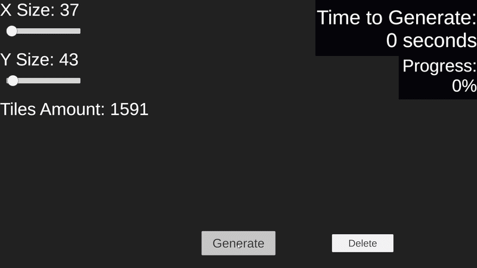
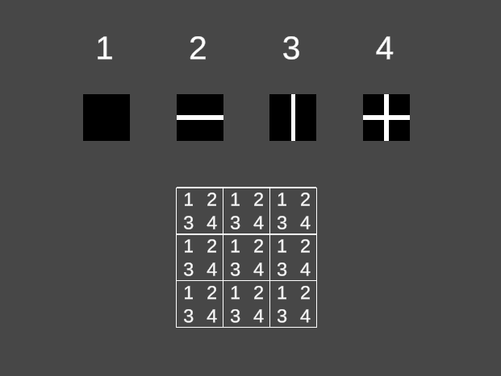
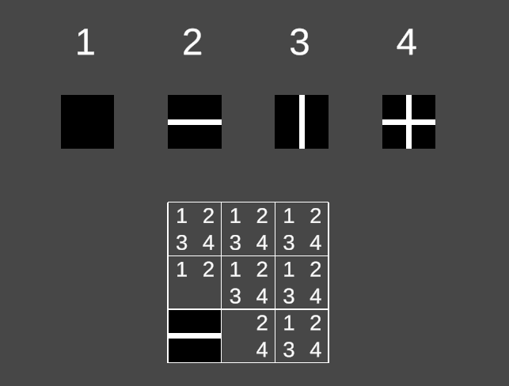
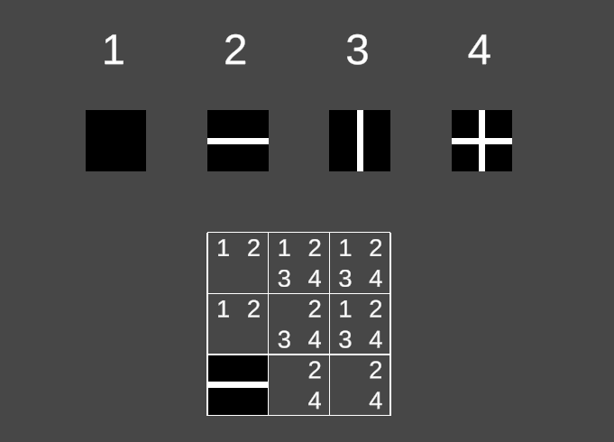
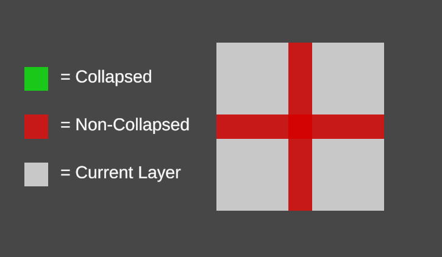
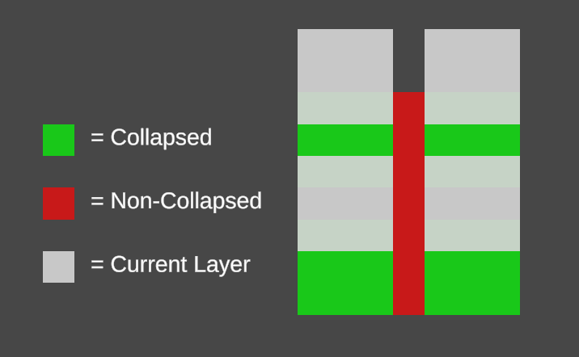
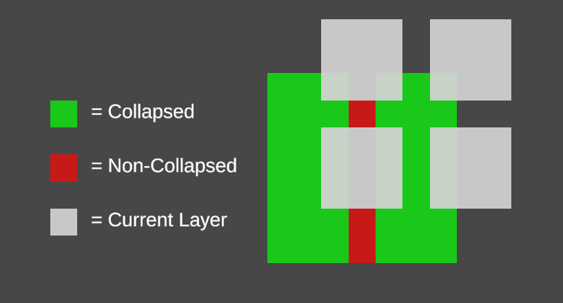
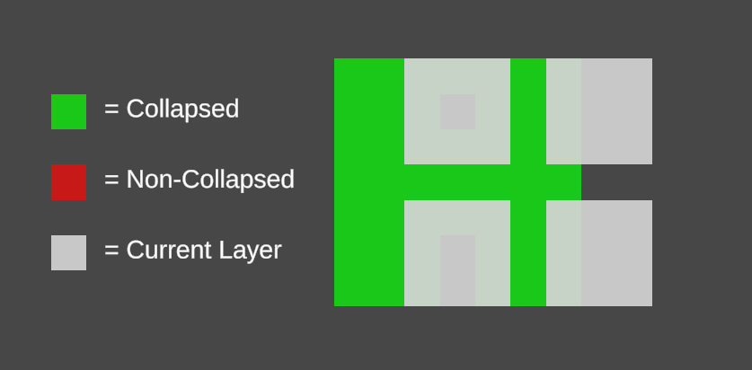
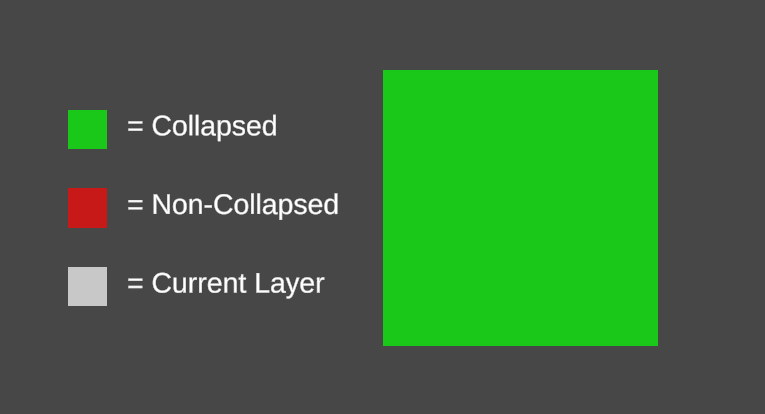

# Multithreaded Wave Function Collapse Algorithm in Unity


## Table of Content
* [What is Wave Function Collapse?](#what-is-wave-function-collapse)

* [Multithreading Wave Function Collapse](#multithreading-wave-function-collapse)

* [My Approach](#my-approach)

* [Code Explanation](#code-explanation)

## What is Wave Function Collapse?
The Wave Function Collapse (WFC) is an algorithm used to generate worlds by following a set of rules. The algorithm starts with a grid of nodes. Every node, initially, can be any type of tile, the amount of possible tiles that each node can be is referred to as its entropy.

***

As an example, here we have 3x3 grid.



Each node can be any of the four tiles shown above the grid, so, every node of the grid currently has an entropy of 4. The algorithm starts by picking the node with least entropy, in this case it will pick the first node of the grid, the one on the bottom left.\
The node is then collapsed into one of its possible tiles.
***


After collapsing the selected node, the algorithm goes to the propagation part, where the neighboring nodes detect the change of the collapsed node, and reduce their entropy by removing the possible tiles that cannot connect to the collapsed node's tile. In the example's case, since the selected node was collapsed into the tile with the horizontal path, the node above has removed the tiles with a vertical path as they don't connect to the collapsed node, and the node to the right has removed the tiles that don't have a horizontal path. The propagation phase doesn't end here, the nodes will also detect if their neighbor have had a change in their entropy, and if they did, they will lower their entropy by removing the possible tiles that don't connect with the possible tiles of the neighbor.

***

The final result of the first iteration will look something like this.



***

From here the algorithm will select another node with the lowest entropy, collapse it, propagate the change to the neighboring nodes, and will continue to do this until the entire grid has been collapsed.

## Multithreading Wave Function Collapse

Since each iteration's result is dependent on the previous one, it can be quite tricky to implement multithreading in the Wave Function Collapse algorithm without the risk of producing conflicting results. While researching some possible solutions, I came across this approach described by BorisTheBrave in [Infinite Modifying In Blocks](https://www.boristhebrave.com/2021/11/08/infinite-modifying-in-blocks/). This approach divides the grid into chunks that are separated from each other by a gap, these chunks will each collapse in parallel. 



Once they are all done, the next layer will move the chunks in one direction along the gap by half of the size of the chunk, this results in each chunk of the new layer now overlapping with two of the chunks of the previous layer, the chunks will then uncollapse the overlapping nodes and then collapse each node. As a result one of the gaps between the chunks of the first layer will be collapsed connecting the two chunks. 

 

This process will be repeated 2 more times so each node of the entire grid will be collapsed at least once. 

 

 



The strongest benefit from this approach is that the amount of work to do is always the same, if the algorithm assigns each chunk to a thread group, then each thread group has to collapse its chunk 4 times before the entire grid is finished.\
The biggest drawback is that, because of the layers and the overlapping chunks, the algorithm is essentially doing a significant amount of work that is later undone by a subsequent layer.

## My Approach

Because of this wasted work, I tried to modify the approach in a way that the algorithm would avoid doing work that would later be discarded.\
My approach still divides the grid into chunks separated by a gap. The first pass collapses each chunk normally. Then, in the next pass, the algorithm shifts the chunks upward by the size of the gap, so that they just cover the gap connecting the two chunks of the first pass, and overlapping only the one chunk of their previous layer.\
Here in BorisTheBrave's approach the new chunk in the new layer would overlap two chunks of the old layer, in my approach each new chunk only overlaps one chunk.\
Another difference is that the algorithm doesn't uncollapse the overlapping nodes, instead, the algorithm will only need to collapse the nodes that have not already been collapsed.\
As a result, the gap connecting the two chunks in the first pass will now be collapsed.\
the algorithm will repeat this process two more times by switching the chunk to the right on the third pass and downward on the fourth and final pass.

The result is a multithreaded WFC approach that aims to minimize redundant work while still allowing the chunks to be processed in parallel.

## Code Explanation

### C#
***

### Compatibility Array

```C#

compat = new uint[tiles.Count * 4];

```

The compatibility array is a uint array where each element is used as a bitmask to determine the compatible tiles for each tile in each direction.
The array takes as input the index of the tile in the "tiles" list, multiplied by 4, which is the amount of sides the tile can be connected to, + the direction of the neighbour we want to connect to the tile, where 0 is upward, and goes around clockwise, the output we will receive from it is the bitmask holding information regarding the compatible tiles.

To populate the array:

```C#

for (int i = 0; i < tiles.Count; i++)
{
    TileWFC tile = tiles[i];

    for (int d = 0; d < directions.Count; d++)
    {
        uint compTiles = 0;

        for (int j = 0; j < tiles.Count; j++)
        {
            TileWFC compTile = tiles[j];

            if(tile.GetSocket(d) == compTile.GetSocket((d + 2) % directions.Count))
                compTiles |= (uint)(1 << j);
        }
        compat[i * 4 + d] = compTiles;
    }
}

```

* We iterate through the tiles list.
* We iterate through each direction the tiles can be connected to.
    * here we have a directions list, a simple Vector2 list holding 4 directions. It starts upward, and goes around clockwise.
    ```C#
    readonly List<Vector2Int> directions = new()
    {
        new(0, 1),
        new(1, 0),
        new(0, -1),
        new(-1, 0)
    };
    ```
* We iterate through the tiles list again.
    * These will be the tiles that we use to see if they can be connected with the tile we got in the first for loop.
* We compare tile A's socket that faces the current direction with tile B's socket that faces the opposite direction.
    * The tiles sockets are int fields, if the sockets hold the same value, that means they connect with each other.
* We mark the connection by setting a bit in the j position, where j is the index of tile B in the tiles list.

By doing so, at the end of the third for loop, we will have a bitmask holding information of the tiles that can connect to tile A in that particular direction, we add that to the array.

***
### Chunk Struct

```C#

public struct Chunk
{
    public Vector2Int startCoord;
    public int edgeSizeX;
    public int edgeSizeY;
    Vector2Int[] passDirections;
    public int passIndex;
    public int subChunkSizeX;
    public int subChunkSizeY;

}

```

The chunk struct holds information regarding the starting node of the chunk instance, the size of the edge, the directions the chunks shift towards at every pass, the current pass, and the size of the collapsing part of the chunk.

The reason why the edgeSize and subChunkSize is separated across the 2 axis, is because, in case the grid total size can't be perfectly divided, the leftover nodes will be assigned to smaller sized chunks.\
For example, if the grid size is 43x20, and the total chunk size (subChunkSize + edgeSize) is 20x20, the grid will have 3 chunks along the x axis, 2 of them will be normal sized, and the last one, instead of being a 20x20 sized chunk, it wil be a 3x20.

Lastly, when the algorithm goes to the next pass and needs to shift the chunks, it simply calls this function on the chunk struct for each chunk in the grid.

```C#

public bool UpdatePass()
{
    if(passDirections == null || passIndex >= passDirections.Length)
        return false;

    Vector2Int passDirection = passDirections[passIndex];
    startCoord = new(startCoord.x + (edgeSizeX * passDirection.x), startCoord.y + (edgeSizeY * passDirection.y));
    passIndex++;
    return true;
}

```

Normally, every chunk needs to go through all four passes before they are done collapsing, but that's not true for the leftover chunks, if the  total size of the leftover chunk is smaller or equal in one of the axis than the size of the subChunk, then there is no need for that chunk to shift along that axis, which means that we can cut 2 passes from that chunk.
***

### Node and NodeInfo

```C#

public class Node
{
    public NodeInfo NodeInfo => nodeInfo;
    NodeInfo nodeInfo;
    NodeInfo originalInfo;
    public Vector2 nodePos;
}

```

Because of the multithreaded approach, we cannot directly use the Node class, instead the NodeInfo struct is what we will pass to the compute shader.

```C#

public struct NodeInfo
{
    public uint possibleTiles;
    public int entropy;
    public uint tile;
    public int x;
    public int y;

    public NodeInfo(int x, int y, uint possibleTiles)
    {
        this.x = x;
        this.y = y;
        this.possibleTiles = possibleTiles;
        entropy = 0;

        while(possibleTiles != 0)
        {
            possibleTiles &= possibleTiles - 1;
            entropy++;
        }

        tile = 0;
    }
}

```
For the same reason, we cannot use a List<> of tiles to determine the possible tiles each node has, so we instead use a bitmask as uint to keep track of the possible tiles,
***
### Compute Shader

The [compute shader](./WaveFunctionCollapse/Assets/ComputeShaderWFC.compute) is made of 4 kernels:

* The [Collapse Kernel](#collapse-kernel)
* The [Propagation Kernel](#propagation-and-update-kernels)
* The [Grid Update Kernel](#propagation-and-update-kernels)
* The [Grid Done Kernel](#grid-done-kernel)

***
### Collapse Kernel

The way the Collapse Kernel works, is that each chunk has one thread group assigned to it, the thread group size is the same as the size of the collapsing part of the chunk, so 16x16.

```glsl

entropies[localIndex] = int2(entropy, globalIndex);

GroupMemoryBarrierWithGroupSync();

for (int i = 128; i > 0; i >>= 1) 
{
    if(localIndex < i)
    {
        int2 node = entropies[localIndex];
        int2 otherNode = entropies[localIndex + i];
        entropies[localIndex] = node.x <= otherNode.x ? node : otherNode;
    }

    GroupMemoryBarrierWithGroupSync();
}

```

each thread is assigned to one of the nodes in the chunk, where they will write the entropy of their assigned node into a group shared array, then half of the threads will compare their assigned node's entropy with one of the second half and keep track of the uncollapsed node with the least entropy, this procedure continues until only one node remains.

```glsl

int nodeIndex = entropies[0].y;
Node node = gridCurrent[nodeIndex];

uint possibleTiles = node.possibleTiles;
entropy = node.entropy;
uint index = RandomIndex(groupSeed + dispatchCounter + nodeIndex, entropy);
node.tile = FindIndexSetBit(possibleTiles, index);
node.possibleTiles = node.tile;
node.entropy = 1;
collapsedNodes[groupIndex * dispatchIterations + dispatchCounter] = node;

```
The node is collapse by picking a random set bit in the possibleTiles bitmask, and finally the node is then saved in a ComputeBuffer which will then be read by the C# side,
***

### Propagation And Update Kernels

The idea behind the Propagation Kernel, is that, with the help of 2 compute buffers, one for the current grid, and one for the grid after the propagation is done, each thread is assigned to a node of the current grid's compute buffer, they will look at their neighbour's tile, if they are collapsed, otherwise they will look at their neighbour's possible tiles, and reduce their entropy by removing tile that cannot connect to their neighbour, the threads will then write their assigned node into the compute buffer of the update grid.

```glsl

[numthreads(1, 1, 1)]
void UpdateGrid(uint3 groupID : SV_GROUPID)
{
    uint x = groupID.x;
    uint y = groupID.y;

    uint index = x * gridSizeY + y;
    gridCurrent[index] = gridNext[index];
}

```

The update Grid Kernel will updating the compute buffers by simply bringing the elements of the updated grid into the old grid.
***

### Grid Done Kernel

```glsl

[numthreads(16, 16, 1)]
void GridDone(uint3 groupID : SV_GROUPID, uint3 groupThreadID : SV_GROUPTHREADID)
{
    uint groupIndex = groupID.x * groupsAmountY + groupID.y;
    int2 startCoord = startCoords[groupIndex];
    int globalX = startCoord.x + groupThreadID.x;
    int globalY = startCoord.y + groupThreadID.y;

    if(globalX >= gridSizeX || globalY >= gridSizeY)
        return;

    int globalIndex = globalX * gridSizeY + globalY;

    if(gridCurrent[globalIndex].tile == 0)
        progressData[groupIndex].doneFlag = 1;
}

```

This kernel's job is to simply check each node of each chunk, and see if they are all collapsed, this information is then used in the C# side to determine if the algorithm should go to the next pass.
