# Multithreaded Wave Function Collapse Algorithm in Unity
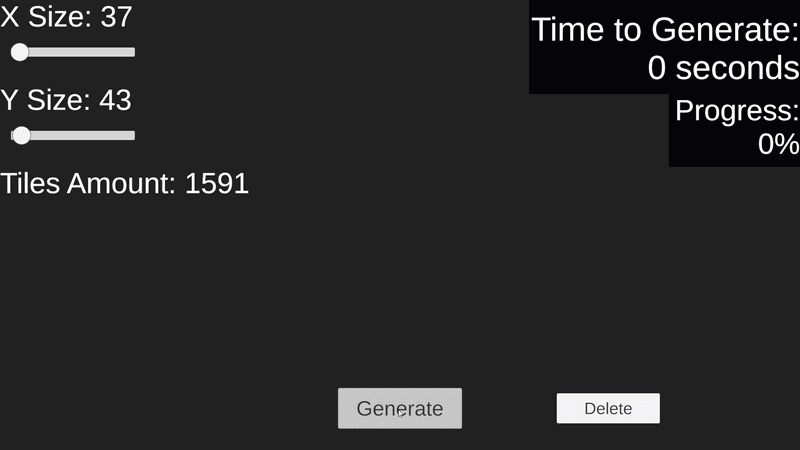

## Table of Content
* [What is Wave Function Collapse?](#what-is-wave-function-collapse)

* [Multithreading Wave Function Collapse](#multithreading-wave-function-collapse)

* [My Approach](#my-approach)

* [Code Explanation](#code-explanation)

* [Performance](#performance)

* [Implementation Limitations](#implementation-limitations)

## What is Wave Function Collapse?
The Wave Function Collapse (WFC) is an algorithm used to generate worlds by following a set of rules. The algorithm starts with a grid of nodes. Every node, initially, can be any type of tile, the amount of possible tiles that each node can be is referred to as its entropy.

***

As an example, here we have 3x3 grid.

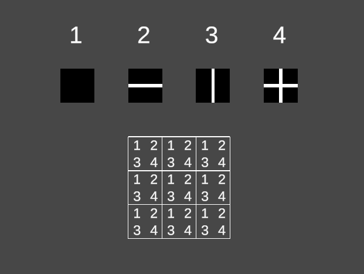

Each node can be any of the four tiles shown above the grid, so, every node of the grid currently has an entropy of 4. The algorithm starts by picking the node with least entropy, in this case it will pick the first node of the grid, the one on the bottom left.\
The node is then collapsed into one of its possible tiles.
***
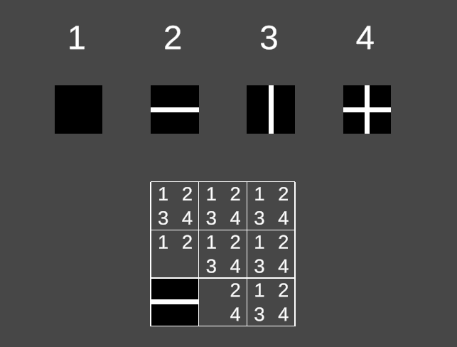

After collapsing the selected node, the algorithm goes to the propagation part, where the neighboring nodes detect the change of the collapsed node, and reduce their entropy by removing the possible tiles that cannot connect to the collapsed node's tile. In the example's case, since the selected node was collapsed into the tile with the horizontal path, the node above has removed the tiles with a vertical path as they don't connect to the collapsed node, and the node to the right has removed the tiles that don't have a horizontal path. The propagation phase doesn't end here, the nodes will also detect if their neighbor have had a change in their entropy, and if they did, they will lower their entropy by removing the possible tiles that don't connect with the possible tiles of the neighbor.

***

The final result of the first iteration will look something like this.

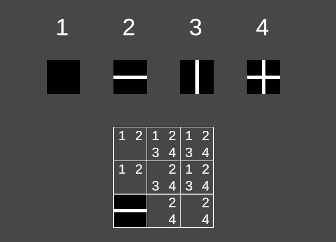

***

From here the algorithm will select another node with the lowest entropy, collapse it, propagate the change to the neighboring nodes, and will continue to do this until the entire grid has been collapsed.

## Multithreading Wave Function Collapse

Since each iteration's result is dependent on the previous one, it can be quite tricky to implement multithreading in the Wave Function Collapse algorithm without the risk of producing conflicting results. While researching some possible solutions, I came across this approach described by BorisTheBrave in [Infinite Modifying In Blocks](https://www.boristhebrave.com/2021/11/08/infinite-modifying-in-blocks/). This approach divides the grid into chunks that are separated from each other by a gap, these chunks will each collapse in parallel. 

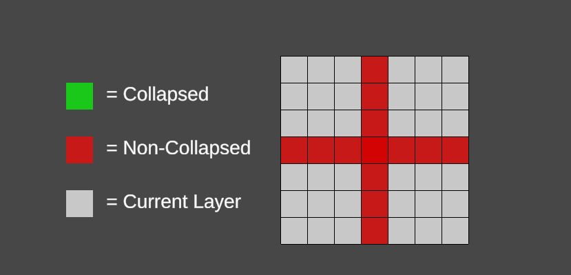

Once they are all done, the next layer will move the chunks in one direction along the gap by half of the size of the chunk, this results in each chunk of the new layer now overlapping with two of the chunks of the previous layer, the chunks will then uncollapse the overlapping nodes and then collapse each node. As a result one of the gaps between the chunks of the first layer will be collapsed connecting the two chunks. 

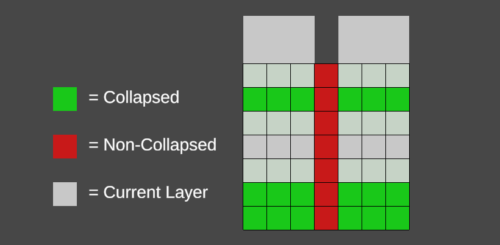 

This process will be repeated 2 more times so each node of the entire grid will be collapsed at least once. 

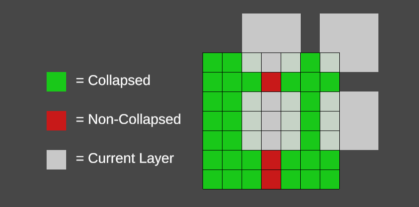 

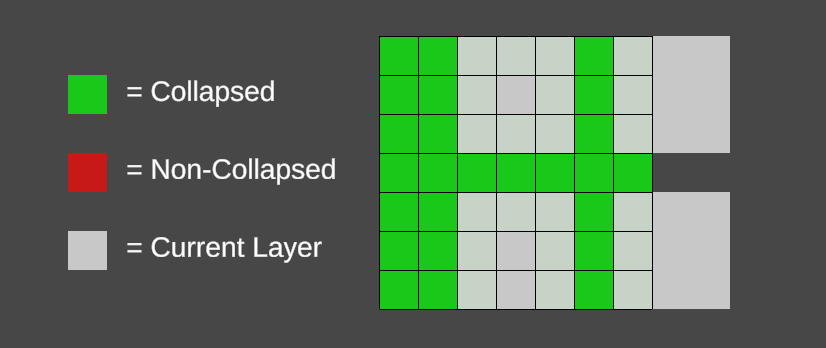 

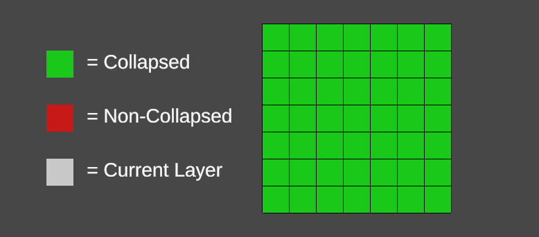

The strongest benefit from this approach is that the amount of work to do is always the same, if the algorithm assigns each chunk to a thread group, then each thread group has to collapse its chunk 4 times before the entire grid is finished.\
The biggest drawback is that, because of the layers and the overlapping chunks, the algorithm is essentially doing a significant amount of work that is later undone by a subsequent layer.

## My Approach

Because of this wasted work, I tried to modify the approach in a way that the algorithm would avoid doing work that would later be discarded.\
We first divide the grid in chunks, we then take a smaller part of the chunk, a sub chunk, this smaller part is the collapsing part of the chunk.\
The result will look something like this:

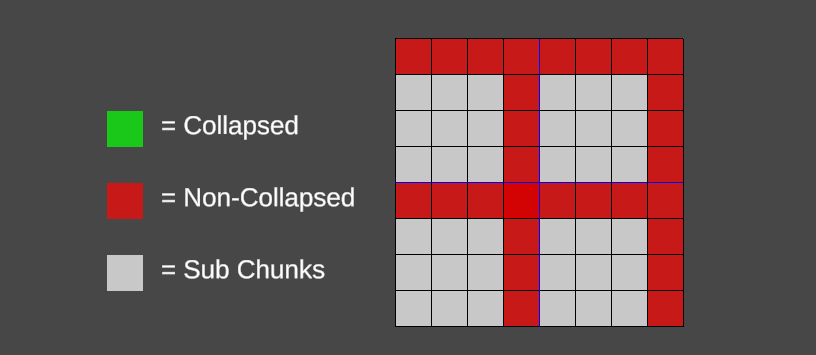

When the sub chunk have done collapsing, the algorithm will then shift the sub chunks upward until they cover the edge of their chunk, this will result in the sub chunk of the new pass now overlapping the sub chunk of the previous pass without going over and overlapping sub chunks of other chunks.

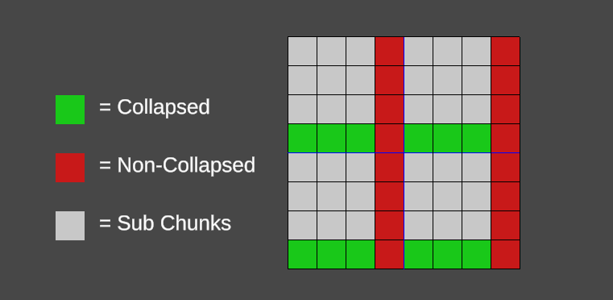

The sub chunks are then collapsed once again without uncollapsing the overlapping nodes, the algorithm will instead skip any node that is already collapsed from a previous pass. At the end of the pass we can see that some of the chunks will now look connected:

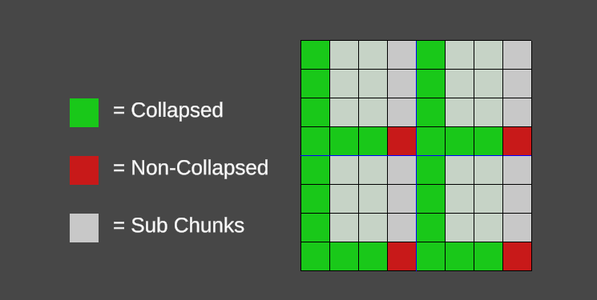

This process is also repeated 2 more times. In the third pass the sub chunks will shift to the left, and in the fourth and final pass the sub chunks will shift downward.

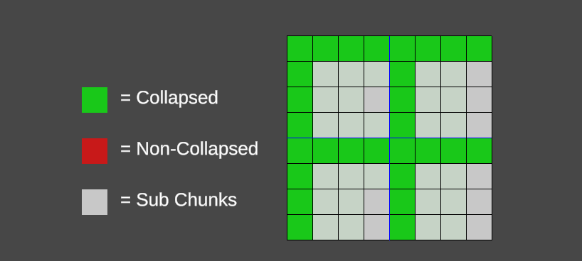

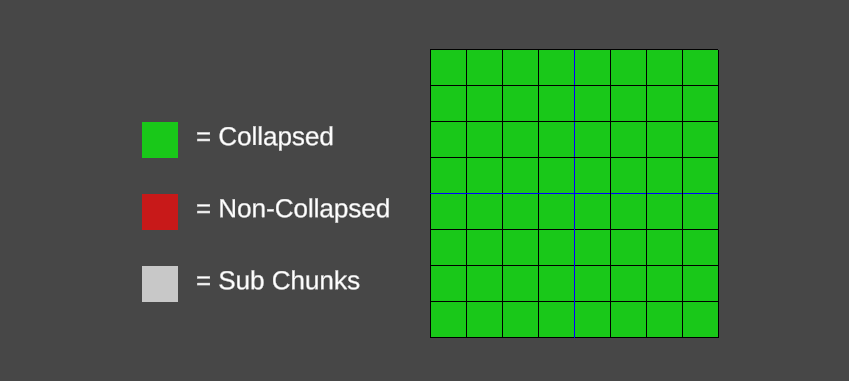

The result is a multithreaded WFC approach that aims to minimize redundant work while still allowing the chunks to be processed in parallel.

## Code Explanation

### C#
***

### Compatibility Array

```C#

compat = new uint[tiles.Count * 4];

```

The compatibility array is a `uint` array where each element is used as a bitmask to store which tiles are compatible with a given tile in a specific direction.

The array is indexed using:

tileIndex * 4 + direction

Since each tile has four possible directions, the first four elements correspond to the first tile, the next four to the second tile, and so on.

The directions are represented by a `Vector2Int` list, starting upward and proceeding clockwise:

```C#

readonly List<Vector2Int> directions = new()
{
    new(0, 1),
    new(1, 0),
    new(0, -1),
    new(-1, 0)
};

```

For example, `compat[i * 4 + d]` returns the bitmask containing all tiles that can be placed next to tile `i` in direction `d`.

**To populate the array:**

```C#

for (int i = 0; i < tiles.Count; i++)
{
    TileWFC tile = tiles[i];

    for (int d = 0; d < directions.Count; d++)
    {
        uint compTiles = 0;

        for (int j = 0; j < tiles.Count; j++)
        {
            TileWFC compTile = tiles[j];

            if(tile.GetSocket(d) == compTile.GetSocket((d + 2) % directions.Count))
                compTiles |= (uint)(1 << j);
        }
        compat[i * 4 + d] = compTiles;
    }
}

```

The array is populated using three nested loops:

1. Iterate through every tile.\
This is the tile for which we want to find compatible neighbours.
2. Iterate through each direction.\
For each direction, we determine which tiles are compatible with the current tile.
3. Iterate through every tile again.\
Each tile is tested as a potential compatible neighbour.

The sockets of the two tiles are then compared. The socket of tile A facing the current direction is compared with the socket of tile B facing the opposite direction:

`if(tile.GetSocket(d) == compTile.GetSocket((d + 2) % directions.Count))`

The sockets are represented as integer fields. If the the values are equal it means the tiles can connect.

When the two tiles are compatible, the bit corresponding to tile's B index is set:\
`compTiles |= (uint)(1 << j);`


By doing so, at the end of the innermost for loop, `compTiles` contains a bitmask representing every tile that can connect to tile A in the current direction. This bitmask is then stored in the compatibility array.

***
### Chunk Struct

```C#

public struct Chunk
{
    public Vector2Int startCoord;
    public int edgeSizeX;
    public int edgeSizeY;
    Vector2Int[] passDirections;
    public int passIndex;
    public int subChunkSizeX;
    public int subChunkSizeY;

}

```

The `Chunk` struct holds information needed to work on a portion of the grid. This includes:
* Its starting coordinates.
* The size of its edges.
* The directions used to shift the subChunk between passes.
* The current pass.
* The size of the subChunk, the collapsing area of the chunk.

The `edgeSize` and `subChunkSize` values are stored separately for the X and Y axes because the grid may not divide evenly into chunks.

For example, if the grid size is 43x20, and the total chunk size (subChunkSize + edgeSize) is 20x20, the grid can be divided into 3 chunks along the X axis. The first two chunks will be 20x20, while the remaining chunk will be 3x20.

When the algorithm goes to the next pass, the chunk's starting coordinate is updates using the following method:

```C#

public bool UpdatePass()
{
    if(passDirections == null || passIndex >= passDirections.Length)
        return false;

    Vector2Int passDirection = passDirections[passIndex];
    startCoord = new(startCoord.x + (edgeSizeX * passDirection.x), startCoord.y + (edgeSizeY * passDirection.y));
    passIndex++;
    return true;
}

```

Normally, a chunk needs to go through all four passes before it has finished collapsing. However, depending on the size of the grid, leftover chunks can sometimes be smaller than the sub-chunk size along on of their axes.\
In these cases, the chunk does not need to shift along that axis. This allows the corresponding passes to be skipped for those chunks, reducing unnecessary work.
***

### Node and NodeInfo

```C#

public class Node
{
    public NodeInfo NodeInfo => nodeInfo;
    NodeInfo nodeInfo;
    public Vector2 nodePos;
}

```

The `Node` class represents a cell in the grid.

However, because the generation is performed using a compute shader, the class itself cannot be passed directly to the shader. Instead, the data needed by the compute shader is stored in the `NodeInfo` struct:

```C#

public struct NodeInfo
{
    public uint possibleTiles;
    public int entropy;
    public uint tile;
    public int x;
    public int y;

    public NodeInfo(int x, int y, uint possibleTiles)
    {
        this.x = x;
        this.y = y;
        this.possibleTiles = possibleTiles;
        entropy = 0;

        while(possibleTiles != 0)
        {
            possibleTiles &= possibleTiles - 1;
            entropy++;
        }

        tile = 0;
    }
}

```
Instead of storing the possible tiles the node can be into a `List<>`, the `NodeInfo` struct uses a `uint` bitmask.

This allows the possible tiles of a node to be stored in a compact format and makes it possible to perform compatibility checks and remove possibilities using bitwise operations.

The `entropy` value represents the number of possible tiles remaining for the node. It is calculated by counting the number of set bits in `possibleTiles`.

`possibleTiles &= possibleTiles - 1;`

This operation removes the lowest set bit. Repeating it until the value reaches zero gives the total number of possible tiles.
***
### Compute Shader

The [compute shader](./WaveFunctionCollapse/Assets/ComputeShaderWFC.compute) contains four kernels:

* The [Collapse Kernel](#collapse-kernel)
* The [Propagation Kernel](#propagation-and-update-kernels)
* The [Grid Update Kernel](#propagation-and-update-kernels)
* The [Grid Done Kernel](#grid-done-kernel)

***
### Collapse Kernel

The [Collapse Kernel](https://github.com/Riky-17/WaveFunctionCollapseUnity/blob/a27eba7d5ae6715831515d423d91a8eb6bc13243/WaveFunctionCollapse/Assets/ComputeShaderWFC.compute#L160-L217) is responsible for finding and collapsing the node with the lowest entropy within each chunk.

Each chunk is assigned to one thread group, with the thread group size matching the size of the sub-chunk, the chunk's collapsing part. In this implementation, the collapsing area is 16x16, resulting in 256 threads per group.

Each thread is assigned to one node and writes its entropy, along its global index, into a group-shared memory:

```glsl

entropies[localIndex] = int2(entropy, globalIndex);

GroupMemoryBarrierWithGroupSync();

```

The thread then performs a parallel reduction to find the node with the lowest entropy:

```glsl

for (int i = 128; i > 0; i >>= 1) 
{
    if(localIndex < i)
    {
        int2 node = entropies[localIndex];
        int2 otherNode = entropies[localIndex + i];
        entropies[localIndex] = node.x <= otherNode.x ? node : otherNode;
    }

    GroupMemoryBarrierWithGroupSync();
}

```

At each iteration, half of the remaining thread compare their current node with another node from the second half of the array. The node with the lower entropy is kept.\
The number of active threads is halved after each iteration.

Once the loop is done, `entropies[0]` contains the index of the node with the lowest entropy.\
The selected node is then collapsed by randomly choosing one of the set bits in its `possibleTiles` bitmask:

```glsl

int nodeIndex = entropies[0].y;
Node node = gridCurrent[nodeIndex];

uint possibleTiles = node.possibleTiles;
entropy = node.entropy;
uint index = RandomIndex(groupSeed + dispatchCounter + nodeIndex, entropy);
node.tile = FindIndexSetBit(possibleTiles, index);
node.possibleTiles = node.tile;
node.entropy = 1;
collapsedNodes[groupIndex * dispatchIterations + dispatchCounter] = node;

```

`RandomIndex` generates a random number that ranges from 0 up to the entropy of the tile, `FindIndexSetBit` then converts the index in a bitmask where the only set bit represents the tile the node is collapsed as. The collapsed node is then stored in the `collapsedNodes` buffer so that it can be read bak by the c# side. 
***

### Propagation And Update Kernels

The [Propagation Kernel](https://github.com/Riky-17/WaveFunctionCollapseUnity/blob/a27eba7d5ae6715831515d423d91a8eb6bc13243/WaveFunctionCollapse/Assets/ComputeShaderWFC.compute#L53-L119) is responsible for reducing the possible tiles of each node based on their neighbours.

The propagation uses two compute buffers:
* `gridCurrent`: the current state of the grid.
* `gridNext`: the grid after the current propagation step.

Using two buffers prevents threads from reading values that have already been modified during the same propagation step.

Each thread processes one node from `gridCurrent`, examines its four neighbours and calculates which tile remain valid

**Collapsed Neighbors**

If a neighboring node has already collapsed, only its selected tile needs to be considered.

The compatibility array is accessed using the followin method:

```glsl

uint CompNeighTiles(uint dToN, int t)
{
    return compat[t * 4 + (dToN + 2) % 4];
}

```

For a collapsed neighbor, its selected tile is used to retrieve the set of tiles that can connect to it:

```glsl

for (int d = 0; d < 4; d++) 
{
    //...

    Node neighbour = gridCurrent[neighbourIndex];
    
    if(neighbour.entropy == 1)
    {
        int t = firstbitlow(neighbour.possibleTiles);
        uint connectingTiles = CompNeighTiles(d, t);

        possibleTiles &= connectingTiles;

        continue;
    }

    //...

}

```

The current node's `possibleTiles` bitmask is intersected with the compatible tiles using a bitwise AND operation.\
This will remove any tile that cannot connect to the collapsed neighbor.

**Uncollapsed Neighbors**

If the neighbor has not yet collapsed, the thread will instead iterate through the neighbor's `possibleTiles` bitmask and combine the compatibility sets of all it possible tiles:

```glsl

for (int d = 0; d < 4; d++) 
{
    //...

    Node neighbour = gridCurrent[neighbourIndex];
    
    uint neighbourTiles = neighbour.possibleTiles;
    uint possibleConnTiles = 0;

    while(neighbourTiles != 0)
    {
        int t = firstbitlow(neighbourTiles);

        uint connectingTiles = CompNeighTiles(d, t);
        possibleConnTiles |= connectingTiles;

        neighbourTiles &= (neighbourTiles - 1);
    }

    possibleTiles &= possibleConnTiles;
}

```

`possibleConnTiles` represents every tile that could connect to at least one of the neighbor's possible tiles.\
Using a bitwise AND operation, the current node will then only keep the tiles already present in its bitmask.

Once all four neighbors have been processed, the thread writes the resulting node into `gridNext`.


The [Update Grid Kernel](https://github.com/Riky-17/WaveFunctionCollapseUnity/blob/a27eba7d5ae6715831515d423d91a8eb6bc13243/WaveFunctionCollapse/Assets/ComputeShaderWFC.compute#L219-L227) updates the compute buffers by copying the elements in the `gridNext` buffer into the `gridCurrent` buffer.

```glsl

[numthreads(1, 1, 1)]
void UpdateGrid(uint3 groupID : SV_GROUPID)
{
    uint x = groupID.x;
    uint y = groupID.y;

    uint index = x * gridSizeY + y;
    gridCurrent[index] = gridNext[index];
}

```

This completes one propagation step and makes the updated grid the input for the next step.

***

### Grid Done Kernel

The [Grid Done Kernel](https://github.com/Riky-17/WaveFunctionCollapseUnity/blob/a27eba7d5ae6715831515d423d91a8eb6bc13243/WaveFunctionCollapse/Assets/ComputeShaderWFC.compute#L229-L244) checks whether all nodes belonging to a chunk have been collapsed.

Each thread corresponds to one node within its chunk:

```glsl

[numthreads(16, 16, 1)]
void GridDone(uint3 groupID : SV_GROUPID, uint3 groupThreadID : SV_GROUPTHREADID)
{
    uint groupIndex = groupID.x * groupsAmountY + groupID.y;
    int2 startCoord = startCoords[groupIndex];
    int globalX = startCoord.x + groupThreadID.x;
    int globalY = startCoord.y + groupThreadID.y;

    if(globalX >= gridSizeX || globalY >= gridSizeY)
        return;

    int globalIndex = globalX * gridSizeY + globalY;

    if(gridCurrent[globalIndex].tile == 0)
        progressData[groupIndex].doneFlag = 1;
}

```

## Performance

If we compare the performance of the single threaded version of the algorithm with the multi threaded approach, we can see that the single threaded version is actually more preferable on smaller grids, but as the grid becomes bigger and the amount of work increases, the multi threaded approach becomes faster.

| Grid Size | Single Threaded | Multi Threaded | Speed Up |
| --- | ---: | ---: | ---: |
| 50x50 | 80ms | 435ms | 0.18x |
| 100x100 | 318ms | 647ms | 0.49x |
| 150x150 | 673ms | 835ms | 0.81x |
| 200x200 | 1234ms | 1058ms | 1.17x |
| 300x300 | 2865ms | 1695ms | 1.69x |
| 400x400 | 5193ms | 2840ms | 1.83x |

*Note: The comparison was made without keeping track of the time it takes for Unity to instantiate all of the game objects at once in the multithreaded approach, if we keep track of it, then the multithreaded approach will result slightly slower than the single threaded approach.

## Implementation Limitations

While this implementation provides performance benefits from GPU processing and bitmask representation, it also introduces a few limitations.

### Maximum of 32 Tiles

The possible tiles of each node are stored in a `uint` bitmask, with each bit representing one possible tile.

Since uint have 32 bits, the maximum amount of tiles a bitmask can hold is 32.

Supporting more tiles would require a different representation, such as multiple `uint` values or a larger bitset. However, this would make the compatibility and propagation operations more complex and potentially reduce some of the performance benefits of the current approach.

### Fixed Thread Group Size

The Collapse kernel and the Grid Done Kernel rely on a 16x16 thread group, giving each chunk 256 threads:

`[numthreads(16, 16, 1)]`

The dimensions of a compute shader's thread group are compile-time constants, meaning they cannot be dynamically changed.

Because this implementation maps one thread to each node in the collapsing area, the sub-chunk size is therefore fixes to 16x16.

This means that the current implementation cannot dynamically adjust the sub-chunk size based on the grid dimensions, or even from the unity inspector.